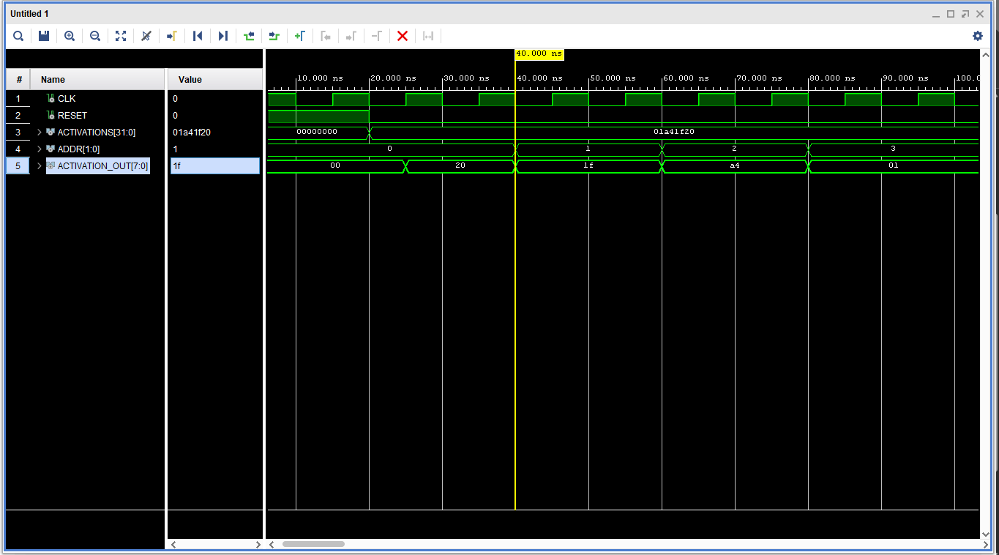

# Activation Buffer

## Overview

The main function of the Activation Buffer is to temporarily store activations and send them to their designated Activation FIFO address. It behaves like a reverse Parameter Buffer. 

## Working Mechanism

It consists of a parameterized Multiplexer and an array of buffer registers. The selector of the multiplexor specifies the unique Activation FIFO address where each activation will be stored. The output of each buffer register will be connected to each corresponding MAC unit. The Activation Buffer also receives signals from the MACU for Activation FIFO memory allocation. 

## Simulation

I ran behavioral simulations for a 4 Activation Buffer (K=2) and I have attached it below:

