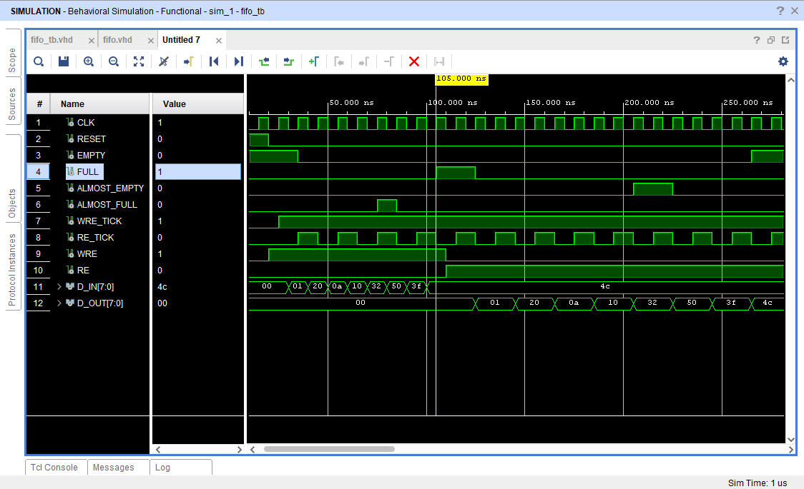

#Activation FIFO

##Overview
The main role of the Activation FIFO is to temporarily store activations and send them to the MAC Array for next layer computations.

##Working Mechanism
During the STORE state of MACU (MAC Array Control Unit) FSM activations are written in to the Activation FIFO from the Activation Buffer. Once the Activation Buffer is empty the MACU transitions into the FETCH state.
In this state, activations are read from the Activations FIFO and fed into the MAC Array for computation.

##Simulation
Behavioural simulation was carried out for a FIFO with depth 8 and width 8 , the simulation results are attached below:

