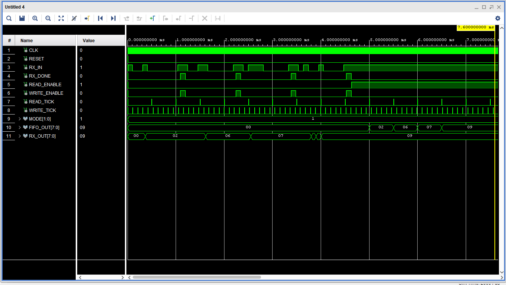

# Input Features Buffer

## Overview

The Input Features Buffer consists of a UART Receiver, Asynchronous FIFO and a Clock divider all controlled by the MAC Array Control Unit.

## Working Mechanism

The UART Receiver samples the input features(data) sent from the PC after preprocessing. Once data is received, the Control Unit instructs the FIFO to write the data into its memory. This process repeats until the FIFO is FULL. Once the FIFO is FULL, it notifies the Control unit and the data is read from the FIFO memory and sent to the MAC Array for computation.

The Clock Divider generates the read and write tick signals which correspond to the Clock A and Clock B signals of the FIFO. However the read tick signal for the FIFO will be the generated compute enable signal from the MACU hence the read tick output of the Clock Divider will be left open. 

This ensures synchronization between the input features and their corresponding parameters sent to the MAC Array during computation. Since input features will be sent from the PC at a slower rate whilst the MAC Array needs to read the input features at a much higher frequency ,an Async FIFO is required to bridge the different clock domains.

## Simulation

Behavioral simulation for the Input Features Buffer was conducted for a FIFO with depth= 4 and width = 8 showıng all the input, intermediate and output signals.It is attached below along with the RTL Schematic and synthesized design.

