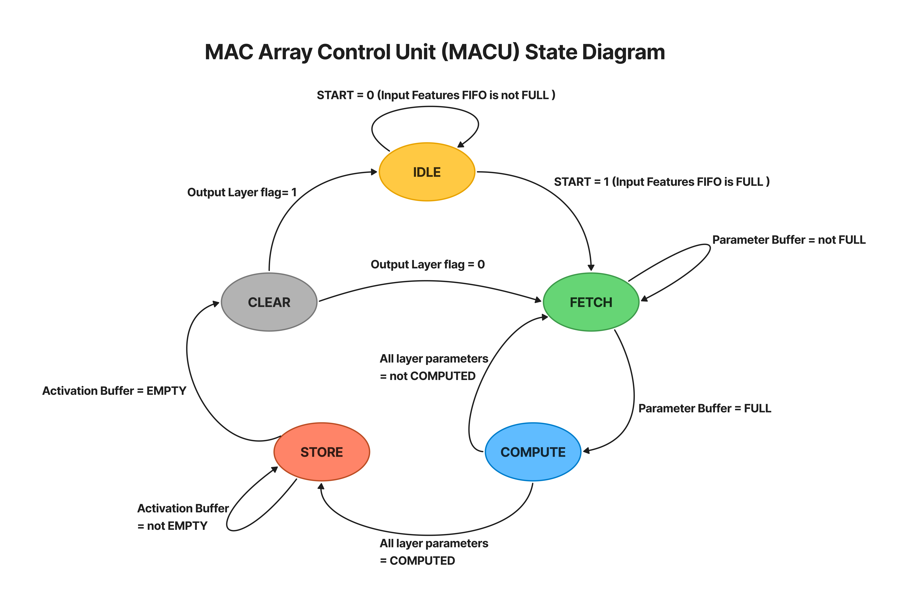
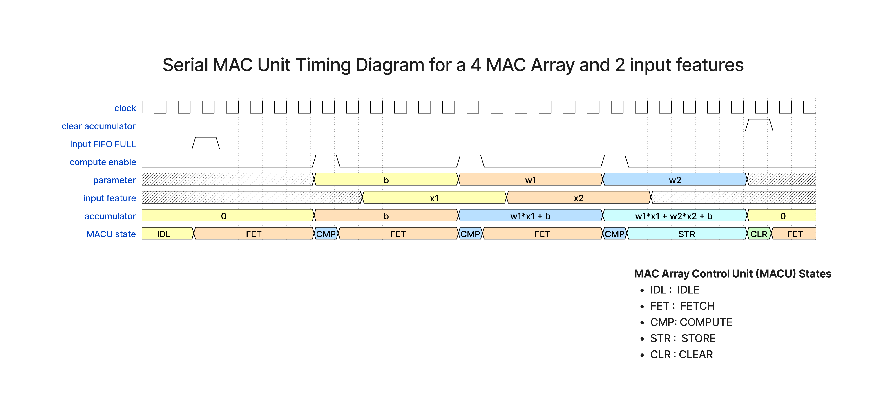

# MAC Array Control Unit

## Overview

The MAC Array Control Unit (MACU) is a FSM with 5 states, IDLE, FETCH, COMPUTE, STORE AND CLEAR .It drives 3 counters, the Distribution Counter, the Activations Counter and the Parameters Counter.

## State Transitions

### MACU State Diagram

### Serial MAC Unit Cycle through different states

### IDLE State

Initially the FSM is held in the IDLE state, when a START(Input Buffer FULL flag) pulse is detected it switches to the FETCH state.

### FETCH State

Once in the FETCH state, it fetches the parameters from the Parameter BRAM to the Parameter Buffer. The Distribution counter and the Parameters counter are both initiated. In this state the Distribution counter generates the parameters destination address(Parameters Buffer) whilst the parameters counter generates the Parameters source address (Parameter BRAM). Once the Parameter Buffer is full it switches to the COMPUTE state.

### COMPUTE State

In the COMPUTE State ,a compute enable pulse is generated for the MAC units computation to start. It also determines if there is any more parameters for the current layer and if yes , it switches back to FETCH state and the whole process repeats again. However if all the parameters for the neurons in the present layer have been fetched it switches to the STORE state.

### STORE State

In the STORE state, activations are transfered from the Activations Buffer and stored in the Activations FIFO . The Distribution counter is initiated again but to generate the activations source address(Activations Buffer). The Activations counter is also initiated to generate the activations destination address. Once the Activation Buffer is empty , it switches to the CLEAR state.

### CLEAR State

In the CLEAR state, a pulse is generated to clear the accumulators for all the MAC units. If the current layer is an output layer, the FSM switches back to IDLE but if not ,the FSM switches back to FETCH and entire cycle repeats again for the next layer.

## Simulation

A simulation was conducted for a Neural Network with 3 layers and a network topology of (4:2:1) neurons per layer and the observed results matched the expected results.
