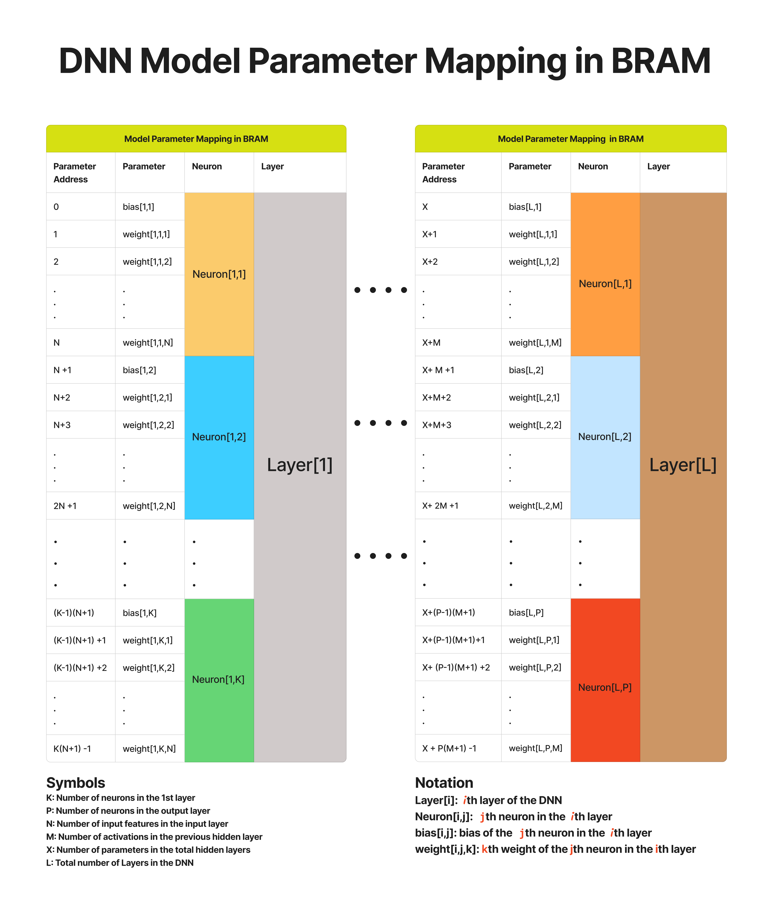

# Parameter BRAM

## Overview

The Parameter BRAM stores all the trained model parameters including the biases and weights of every neuron in the deep neural network. 
It was implemented using the Xilinx Block Memory Generator IP, which provides an efficient solution for storing the model parameters and enables 
single-cycle memory access during inference.

##DNN Model Parameter Mapping in BRAM

The model parameters were quantized and loaded into a Coefficient (COE) file after training and they were stored sequentially in BRAM using a neuron wise mapping strategy. 
For each neuron, the bias is assigned to the first address, followed by its corresponding weights in consecutive addresses. 
The same ordering is repeated for every neuron within a layer, after which the mapping continues with the neurons of the next layer until all model parameters have been stored.
