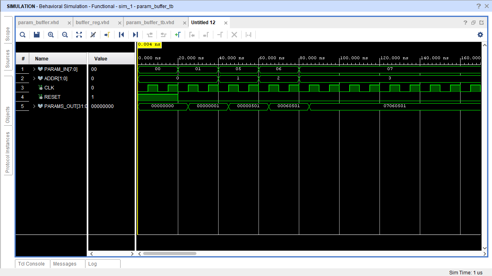

# Parameter Buffer

## Overview

The main goal of the Parameter Buffer is to fetch the Neural Network parameters (weights and biases) from Block RAM to their designated MAC units for computation.

## Operating Mechanism

It consists of a parameterized Demultiplexer(K to 2^K decoder) and an array of buffer registers . The selector of the DEMUX specifies the unique address of the buffer register where each parameter will be temporarily stored before computation . The output of each buffer register will be connected to each corresponding MAC unit. The Parameter Buffer also receives signals from the MACU for proper operational control. Since this design is parameterized the Parameter Buffer for 8, 16 , 32, 64 MAC units can also be made by only changing the K parameter.

## Simulation

I have attached the simulation results and RTL schematic for a 4 -MAC Array Parameter Buffer with a 2 to 4 (K= 2)DEMUX and 4 buffer registers below.

