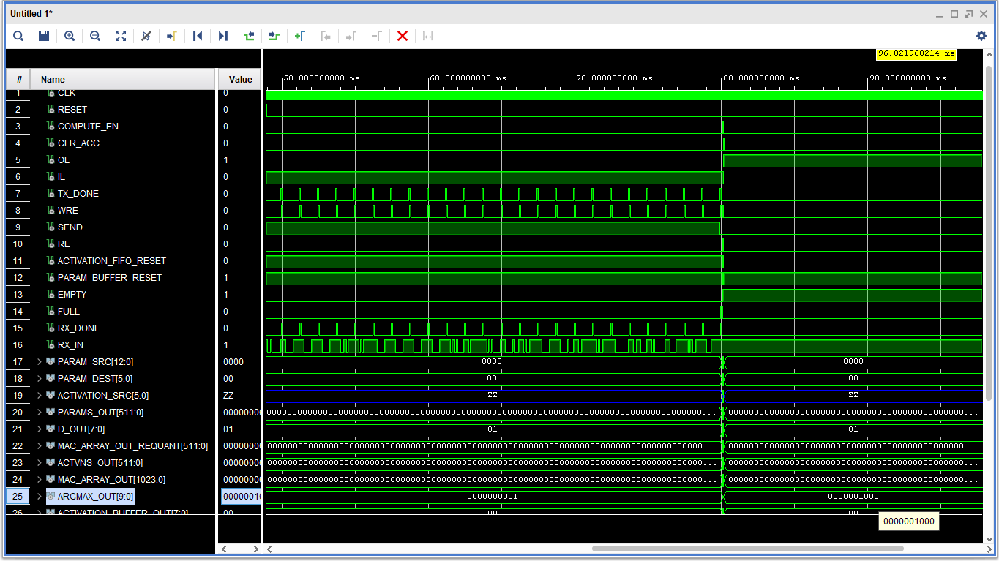
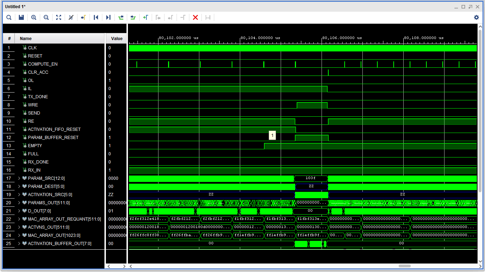
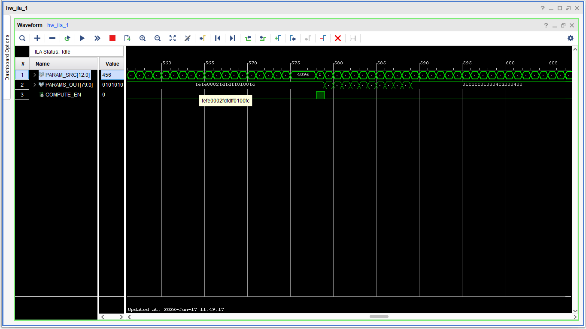
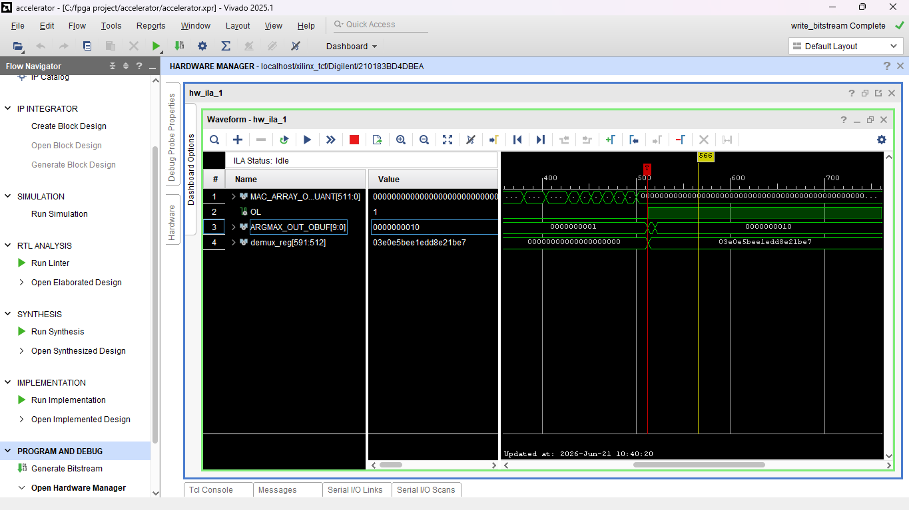

# MAC Array based Deep Neural Network Accelerator

## Overview

After months of dedication and hardwork I'm happy to say that I have finally completed the MAC Array Based Neural Network Accelerator using VHDL on Vivado from scratch(No HLS). 

### Deep Neural Network Accelerator Architecture

### MAC Array Control Unit (MACU) State Diagram

### Timing Diagram for each Serial MAC Unit in a MAC Array

## I designed and implemented:

- A MAC Array Control Unit with 5 states (IDLE, FETCH , COMPUTE, STORE, CLEAR) to control the data movement and computational processes in the entire Accelerator.

- An Input Features Buffer to receive the preprocessed data from my PC via UART, temporarily store them in an async FIFO and send them to the MAC array for computation.

- Parameter BRAM to store the the model parameters.

- A Parameter Buffer to fetch parameters from Parameter BRAM and feed each parameter to its own corresponding MAC unit

- A layer reusable MAC array comprised of Serial MAC units for matrix-vector computations

- Requantization Block to convert the Q8.8 accumulations back to Q4.4.

- An Activation Buffer to temporarily store activations and distribute them to their designated address in the Activation FIFO

- Activation FIFO to temporarily store the activations and feed them back into the MAC array for next layer computation

- ReLU and Argmax Activation blocks for hidden and output layer activation functions 

## Architectural Decisions

The challenging part of this entire project was designing the architecture and before writing any RTL code I asked myself these critical questions:

1. How do I fetch parameters from BRAM and send them to their designated MAC units?

2. How do I store the computed activations and feed them back into the MAC Array for next layer computations?

3. How do I synchronize the incoming input features with their corresponding parameters during computation?

4. How do I receive and handle preprocessed data sent from PC to the FPGA?

5. How do I control and organize all the data movement and computational processes in the Accelerator?

6. How do I design a Serial MAC unit optimized for scalability and resource utilization?

7. How does the Accelerator know when to start running inference?

8. How can I reuse my MAC Array over multiple layers ?

9. How do I make the Accelerator configurable for different neural network topologies?

These questions influenced all my architectural design choices and by addressing them one by one I was able to build the core modules for this project.

## Simulation

Behavioural simulation was carried out by running inference for a pretrained speech recognition model for digits 0-9 and predictions for test data samples matched the expected outcome. 

### Simulation (zoomed in to show intralayer data movement and computaional processes)

### Simulation (zoomed out to show the final Argmax output)

## ILA Debugging

Initially, the Accelerator design worked in simulation but failed on hardware. I use the Integrated Logic Analyzer to compare the MAC Array vs Argmax outputs which showed that Argmax was producing wrong activations. I redesigned it using a serial chain of pipelined comparators and it worked.

### ILA Debugging Session showing the parameter fetch process on hardware 

### ILA Debugging Session comparing the MAC Array vs Argmax output 

## Next Steps

Next I will run hardware inference for other dense neural network models since the accelerator is fully configurable and this will be the fun part. I will also use this project as a foundation for a CNN Accelerator project in the future.