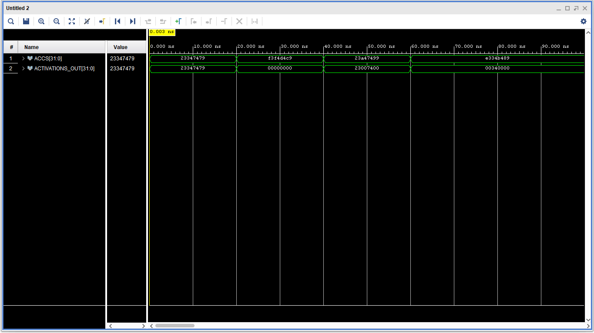
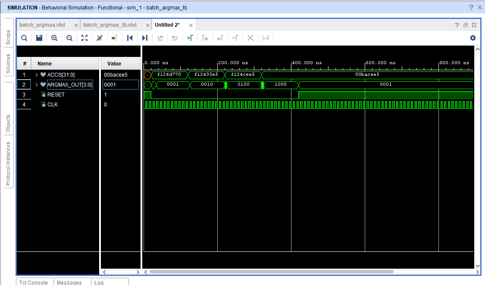

# ReLU and Argmax Activation Functions

## Overview

### Argmax Activation Function (Batch Argmax Function)

It is comprised of serial Comparators and its goal is to determine the index of the maximum accumulation in the output layer. Each Comparator takes 2 in accumulation inputs A and B , outputs the maximum accumulation and its index which is 0 when A>B and 1 when A< B . The first Comparator takes in the first accumulations of the output layer as input and its output is fed into the subsequent Comparator as a input and this process is repeated until all accumulations have been evaluated. 

The index outputs of each comparator are bundled into a databus and evaluated to determine the argmax index.The argmax index equals the position of the most significant '1' bit in the comparator output databus, plus one. To meet timing constraints and avoid setup/hold time violations I registered every comparator output before it is fed as an input for its subsequent comparator. 

### ReLU Activation Function

ReLU stands for Rectified Linear Unit and it only allows positive numbers to pass through while all negative numbers become zero.

### Simulation

Behavioural Simulation for both components was carried out and the observed results matched were as expected.

#### ReLU Simulation

#### Argmax Simulation

